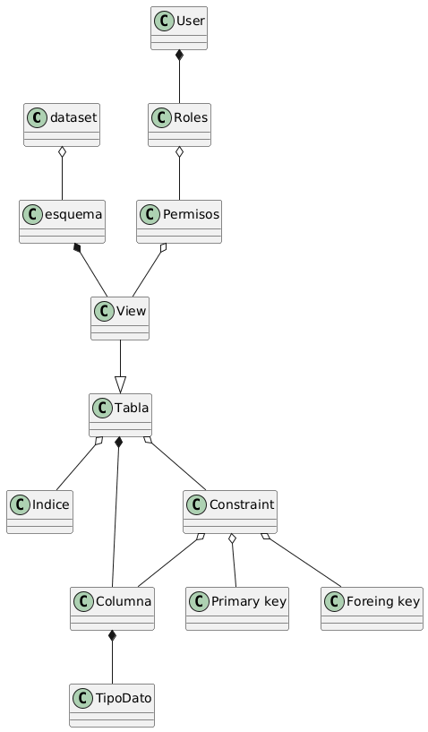

# Parcial - Base de Datos

## Modelo UML

Diagrama de una base de datos con los cambios propuestos en la segunda parte del examen parcial:

- **Dataset**: Contiene esquemas
- **Esquema**: Contiene vistas y tablas
- **Tabla**: Tiene columnas, índices y constraints
- **View**: Hereda de Tabla
- **Columna**: Define el tipo de dato
- **Constraint**: Incluye Primary Key y Foreign Key
- **User**: Tiene roles y permisos asociados
